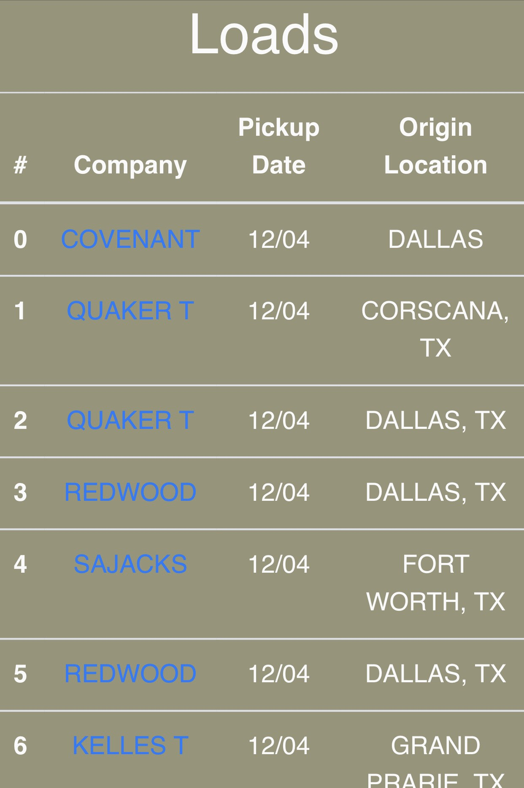

# Reviewed By Trucker


A web app that enables truckers to review a company that post loads. **_Reviewed By Trucker_** was created with Node, Express, HTML, and CSS.

### Preview Samples
| Home View | Loads |
| --- | --- |
| |  |

Website: https://rbt-mc.herokuapp.com/

## Base URL

```
https://rbt-mc.herokuapp.com/
```

User can see a list of loads.

```
Index - https://rbt-mc.herokuapp.com/loads
Show - https://rbt-mc.herokuapp.com/loads/:id
```

## Running Locally
Make sure you have [Node.js](http://nodejs.org/) >= 10.11.0 installed.

```sh
git clone https://github.com/campbellmarianna/Reviewed-By-Trucker.git
cd reviewed-by-trucker
npm i && nodemon
```

The app should now be running on [localhost:3000](http://localhost:3000/).

## Installing
[Mocha](https://mochajs.org/), [Chia](https://www.chaijs.com/), and [Chai-Http](https://github.com/chaijs/chai-http) need to be installed for running test.

```sh
npm install mocha chai chai-http
```

- `mocha` is our Test Runner - it actually runs our test code

- `chai` is our Assertion Library - it gives us syntactic sugar to make writing test intuitive

- `chai-http` is a Helper Test Library - it gives us methods to make http request inside our tests very easy

## Running the tests

Make sure you have Mocha, Chia and Chia-Http installed.

Inside the project directory type `mocha` to run the tests.

### Break down into end to end tests

These tests check each route to make sure a HTML template is rendered.

```
// tell mocha we want to test Loads (this string is taco - it can be anything)
describe('Loads', () => {
    // TEST HOME
    // use taco name for the test
    it('should display homepage on / GET', (done) => {
        // use chai-http to make a request to our server
        chai.request(server)
        // send a GET request to root route
        .get('/')
        // wait for response
        .end((err, res) => {
            // check that the response status is == 200 (success)
            res.should.have.status(200);
            // check that the response is a type html
            res.should.be.html;
            // end this test and move onto the next
            done();
        });
    });
    ...
})
```
