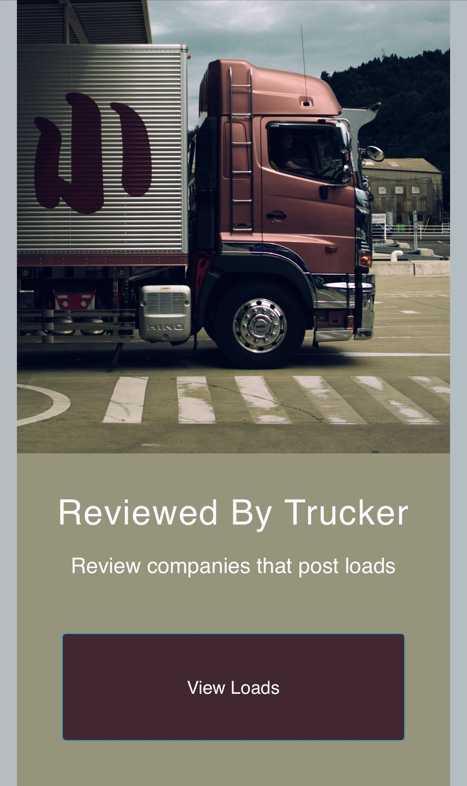

# Reviewed By Trucker

[](https://forthebadge.com)


A web app that enables truckers to review a company that post loads. **_Reviewed By Trucker_** was created with Node, Express, HTML, and CSS.

### Preview Samples
| Home View | Categories |
| --- | --- |
| |  |

Website: https://rbt-mc.herokuapp.com/

## Base URL

## Preview Samples

```
https://rbt-mc.herokuapp.com/
```

User can see a list of loads.

```
Index - https://rbt-mc.herokuapp.com/loads
Show - https://rbt-mc.herokuapp.com/loads/:id
```

## Running Locally
Make sure you have [Node.js](http://nodejs.org/) >= 10.11.0 installed.

```sh
git clone https://github.com/campbellmarianna/Reviewed-By-Trucker.git
cd reviewed-by-trucker
npm i && nodemon
```

The app should now be running on [localhost:3000](http://localhost:3000/).
